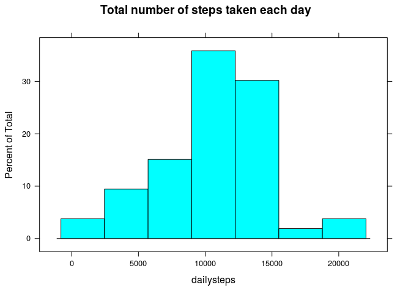
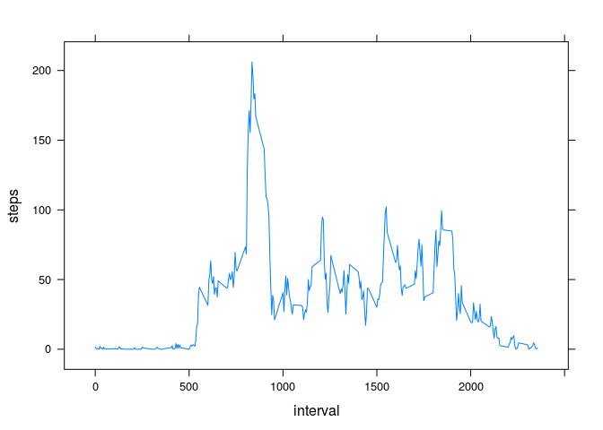

# Reproducible Research: Peer Assessment 1

## Preliminary steps
Before working with the data, I'm going to set some display options for this document and load some libraries.

```r
library(knitr) # Adding this here makes RStudio's Knit HTML button work

# Set some chunk options
opts_chunk$set(echo = TRUE,
               message = FALSE, warning = FALSE,
               cache = FALSE,#, # maybe make this true in the end?
               cache.path = "cache/", 
               fig.path = "figure/"
               )
```


```r
library(dplyr)
library(lubridate)
```

## Loading and preprocessing the data

```r
# Get the data, if needed.
if (!file.exists("activity.csv")) {
  if (!file.exists("activity.zip")) {
    url <- "https://d396qusza40orc.cloudfront.net/repdata%2Fdata%2Factivity.zip"
    destfile <- "activity.zip"
    download.file(url, destfile, method = "curl")
    downloadDate <- date()
  }
unzip(zipfile = "activity.zip")
}

# Missing values are correctly handled by default 'NA',
# but dates need to be forced to strings and then converted
# using dplyr and lubridate.
activity <- read.csv("activity.csv", stringsAsFactors = FALSE)
activity <- mutate(activity, date = ymd(date))
```


## What is mean total number of steps taken per day?

```r
# Get an atomic vector of daily steps, NAs removed
dailysteps <- activity %>%
  group_by(date) %>% 
  select(-interval) %>%
  summarise_each(funs(sum)) %>% 
  select(steps) %>% 
  unlist %>% 
  na.omit
```


```r
hist(dailysteps, main = "Total number of steps taken each day")
```

 

### Mean and median number of steps taken each day

```r
mean(dailysteps)
```

```
## [1] 10766.19
```

```r
median(dailysteps)
```

```
## [1] 10765
```


## What is the average daily activity pattern?

```r
# Compute average steps per interval
intervalsteps <- activity %>%
  group_by(interval) %>%
  select(-date) %>%
  na.omit %>%
  summarise_each(funs(mean))
```

### Time series plot of the average number of steps taken (averaged across all days) versus the 5-minute intervals

```r
plot(steps ~ interval, type = "l", data = intervalsteps)
```

 

### 5-minute interval that on average contains the maximum number of steps

```r
intervalsteps$interval[which.max(intervalsteps$steps)]
```

```
## [1] 835
```

## Imputing missing values
Number of rows with missing values:

```r
sum(!complete.cases(activity))
```

```
## [1] 2304
```

We will impute missing values using the mean for that interval, as calculated in the previous section.

```r
# Make a copy of the orignal data, then add imputed
# values whenever the current value is NA. Use the
# data frame intervalsteps to look up the mean values.
imputed <- activity
for (i in which(is.na(imputed$steps))) {
  imputed$steps[i] <- 
    intervalsteps$steps[match(imputed$interval[i], intervalsteps$interval)]
}
```

### Histogram of total steps after adding imputed values

```r
imputedsteps <- imputed %>%
  group_by(date) %>% 
  select(-interval) %>%
  summarise_each(funs(sum)) %>% 
  select(steps) %>% 
  unlist
```

```r
hist(imputedsteps)
```

 
Because we are using mean interval values to impute data, there now exists a median that happens to be exactly the same value as the mean.

```r
mean(imputedsteps)
```

```
## [1] 10766.19
```

```r
median(imputedsteps)
```

```
## [1] 10766.19
```


## Are there differences in activity patterns between weekdays and weekends?
